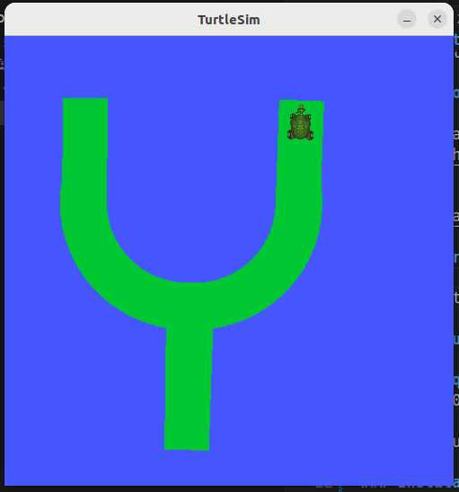

# Zeturguita: O Artista de Desenho do ROS

## Contexto
O projeto "Zeturguita" é uma implementação no ROS 2 (RObot Operating System) projetada para demonstrar interações básicas com o ambiente Turtlesim, promovendo aprendizado através de programação criativa com publishers, nós, tópicos e serviços. Este pacote permite que o usuário desenhe um padrão predeterminado na tela do Turtlesim, exibindo funcionalidades básicas do ROS como spawnar e matar tartarugas, além de manipular o movimento e as configurações da caneta da tartaruga.

## Objetivo/Descrição do Desenho
O objetivo desta atividade é assegurar a compreensão dos conceitos básicos do ROS, necessários para interações futuras com sistemas robóticos mais complexos como o Turtlebot. O script está programado para desenhar (uma tentativa) do logo da [Hyra](https://www.hyravision.com) como saída criativa no ambiente Turtlesim. Este desenho é alcançado através de movimentos e rotações da tartaruga, com cores definidas.

## Demonstração

Uma demonstração completa do projeto pode ser vista aqui: [Link](https://youtu.be/_SVPsxg7GDs)

## Pré-requisitos, Instalação e Uso

### Pré-requisitos
- Ubuntu 20.04
- ROS 2
- Pacote Turtlesim

### Instalação

1. **Clone o repositório**;
2. **Construa o pacote**:
- cd workspace_ros
- colcon build
3. **Source no local_setup.bash**
- cd install/local_setup.bash

### Uso
1. **Execute o zeturguita**:
- ros2 run ponderada_turtlesim zeturguita

